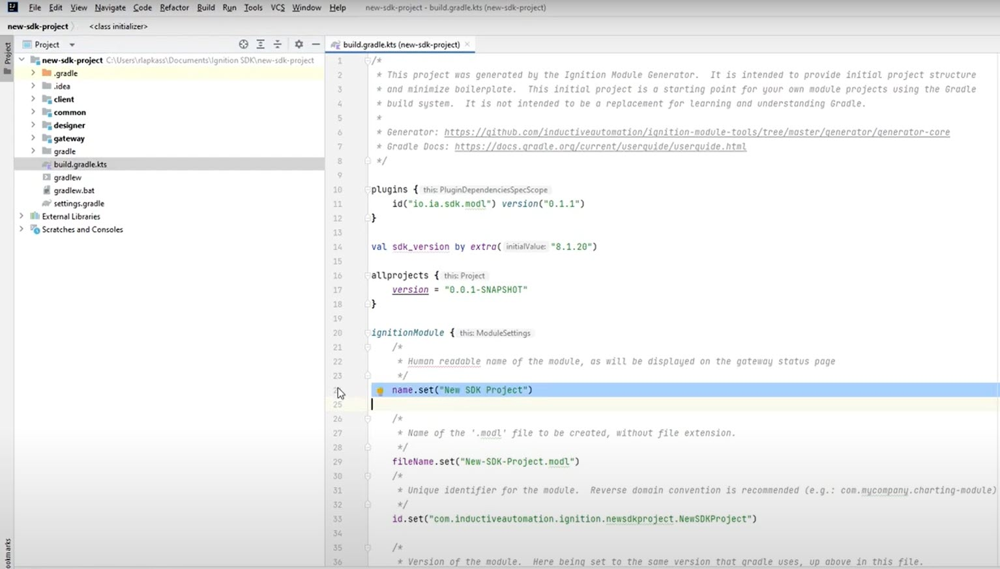

Creating a basic module from scratch is not difficult, but we've tried to minimize startup friction by offering you some tools to help get started. Whether you use Gradle or Maven, you can utilize the provided build tools to generate a new project with a framework that includes the basic structure necessary for your module.

import Tabs from '@theme/Tabs';
import TabItem from '@theme/TabItem';

## Pull tools repository
The tools repository you choose will depend on your build system. Before pulling a repository, make sure [you have Git installed](https://git-scm.com/downloads).

<Tabs groupId="buildTools">
  <TabItem value="gradle" label="Gradle">

```
git clone https://github.com/inductiveautomation/ignition-module-tools
```

  </TabItem>

  <TabItem value="maven" label="Maven">

```
git clone https://github.com/inductiveautomation/ignition-sdk-archetypes
```

  </TabItem>
  </Tabs>  

Once you have the module tools in hand you can generate a new project through the command line.    
## Create a new project


  <Tabs groupId="buildTools">
  <TabItem value="gradle" label="Gradle">

1. Open the directory containing `ignition-module-tools`.
2. Navigate one level down into `generator`.
3. Open a command prompt in this directory and run the following:
  ```
  gradlew.bat clean build
  ```
4. Create a new project:

  ```
  gradlew.bat  runCli -–console plain
  ```

5. Fill in the following information when prompted:

| Prompt | Description | Example |
|--------|-------------|---------|
| Enter scopes: | The scopes your module will require, including Gateway (`G`), Client (`C`), and Designer (`D`). | `GCD` |
| Human readable name: | A name for your new project. | `New SDK Project` |
| Root package: | A reverse domain name specific to your organization and project. | `com.inductiveautomation.ignition.newsdkproject` |
| Language: | Language for gradle buildscripts. Possible values are `kotlin` and `groovy`. Default: `kotlin`. | `kotlin` |

This will create a new project structure for you with seperate directories for each of the Gateway, Designer and Client scopes, as well as a Common and Build directory. If you receive a `BUILD SUCCESSFUL` message, you can close the command prompt and open your new project in your preferred IDE:



 
  </TabItem>

  <TabItem value="maven" label="Maven">

The fastest way to get started with a new Ignition module using Maven is to use a **Maven Archetype**. An archetype is a pre-made structural framework for a Maven project. Your new module will have directories in place, be configured to use the `ignition-maven-plugin` described below, and be ready for you to add your own source. 

With Maven installed, enter the following in the command line:
```
mvn archetype:generate -DarchetypeGroupId=com.inductiveautomation.ignitionsdk -DarchetypeArtifactId=client-designer-gateway-archetype -DarchetypeVersion=1.0.3
```
This archetype will create a new project structure for you with seperate directories for each of the Gateway, Designer and Client scopes, as well as a Common and Build directory. For a full list of the Ignition archetypes, you can browse for [com.inductiveautomation](http://search.maven.org/#search%7Cga%7C1%7Ccom.inductiveautomation) at [Maven Central](http://maven.org/)
  </TabItem>
  </Tabs>
