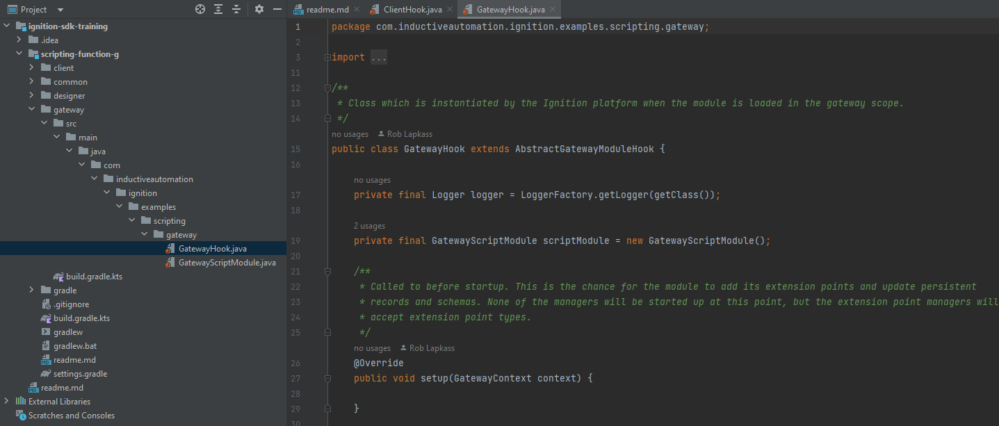

## Overview
This module (`scripting-function-g`) provides a basic example of a scripting function that executes through a remote procedure call (RPC).
In a [client scope](/docs/programming-for-the-client/programming-for-the-client.md), the function delegates to the module's RPC handler, which then calls `multiply` on the gateway and returns the result.

In this tutorial, you'll examine some of the classes that make this function work. Next, you'll add your own function to the `AbstractScriptModule` class provided by the example.

## Getting Started
Once you have configured your developer gateway, make sure git is installed and clone this repo to a directory of your choice: 
```
git clone https://github.com/inductiveautomation/ignition-sdk-training.git
```

Using your IDE of choice, you should be able open the included `scripting-function-g` module through the `settings.gradle.kts` file located in the root directory. 

Upon importing this project into your IDE, it should download (if auto-import is on) necessary dependencies from the Inductive Automation artifact repository. Dependencies are managed through Maven and are cached to your local environment after they are downloaded.
